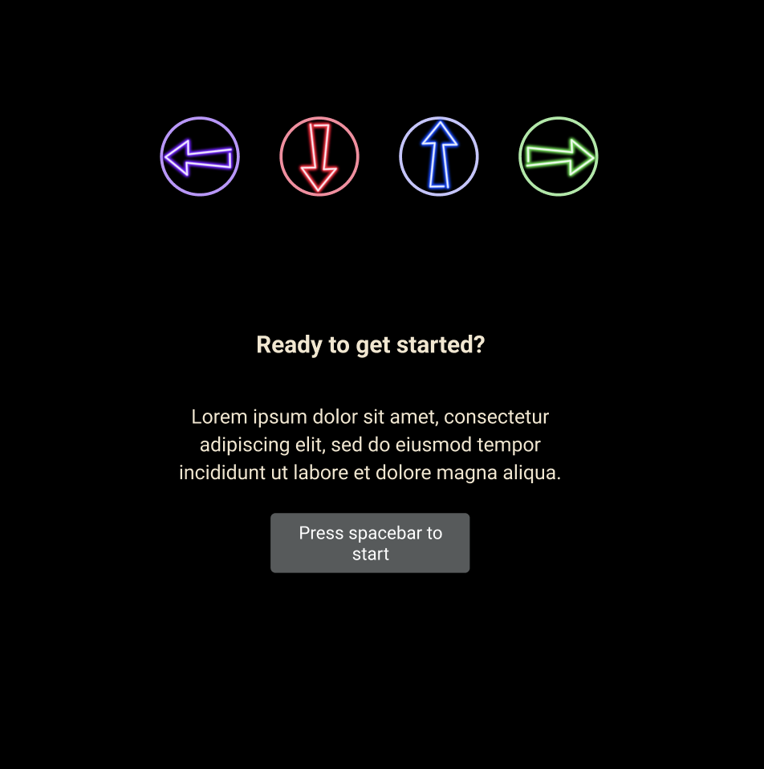

# Disco Tap

Play Disco Tap [here](https://shanenak.github.io/disco-tap/)!

### Background

Inspired by the classic arcade game Dance Dance Revolution, Disco Tap brings the dance floor to your keyboard. Use the arrow keys to tap along to the music.

### Functionality & MVPs

In Disco Tap, users will be able to:

- Listen to groovy tunes
- Follow choreography dictated by arrows floating up the screen
- Use arrows on the keyboard to tap along to the music
- Receive a score and corresponding category based on accuracy and precision of taps

### Technologies, Libraries, and APIs

This site primarily relied on Canvas for graphics. Many thanks to the brilliant artists that provided additional graphics for the interface.

- Luigi Estuye, LUCREATIVE® (@lucreative) for the Dance neon photo
- landondorrier.com for the spinning disco ball

### Implementation Timeline

This project was completed in 5 days on the timeline listed below.

- Friday afternoon & weekend: Floating arrows up the screen at timed intervals
- Monday: Logic of identifying how and when arrows hit targets.
- Tuesday: Music features (start, stop) and UI
- Wednesday: Finalize scoring metrics and refine UI.

The interface was first envisioned with the sketch below and other wireframes.

