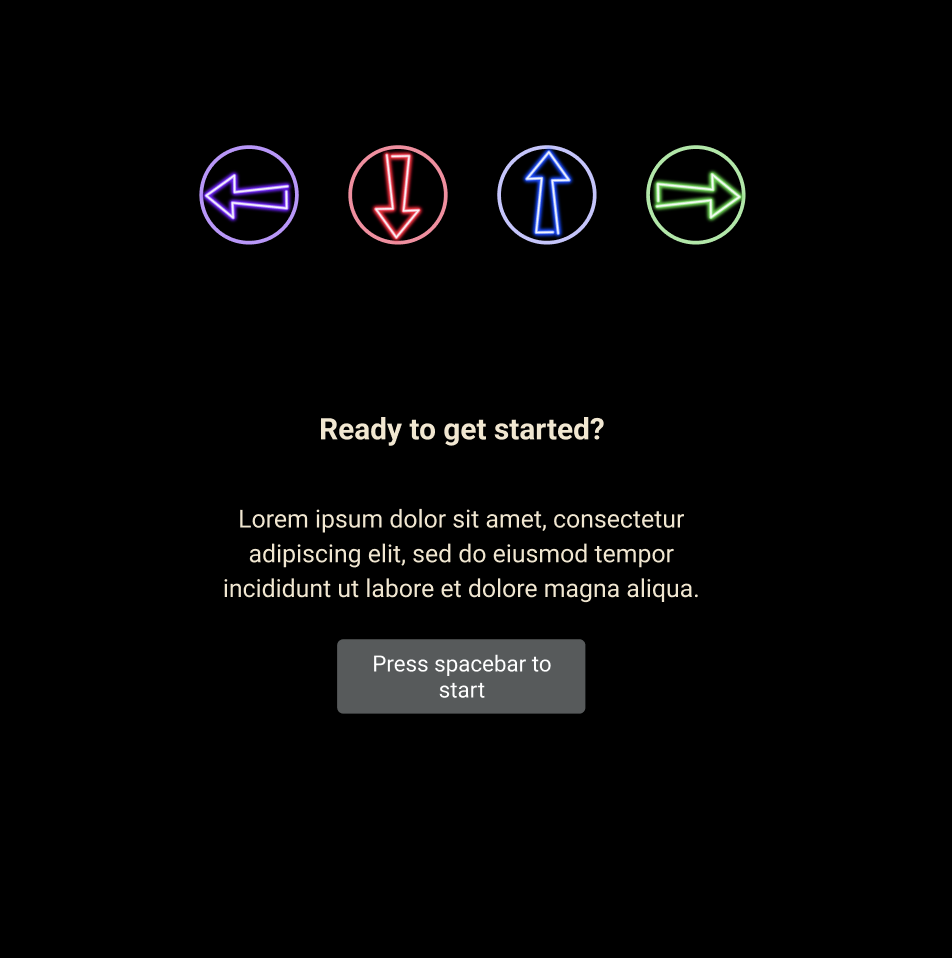

# disco-tap

### Background

Inspired by the classic arcade game Dance Dance Revolution, Disco Tap brings the dance floor to your keyboard. Use the arrow keys to tap along to the music.

### Functionality & MVPs

In Disco Tap, users will be able to:

- Listen to music that starts with the game
- Follow choreography dictated by arrows floating across the screen
- Type arrows on the keyboard to tap along to the music
- Receive a score and corresponding category based on accuracy and precision

### Technologies, Libraries, and APIs

- Canvas API

### Implementation Timeline

- Friday afternoon & weekend: Floating arrows up the screen at timed intervals
- Monday: Check for collisions
- Tuesday: Additional start and demo pages
- Wednesday: Clean up aesthetics, scoring, etc.
- Thursday Morning: Finalize text, positions, etc.

<!--  -->
